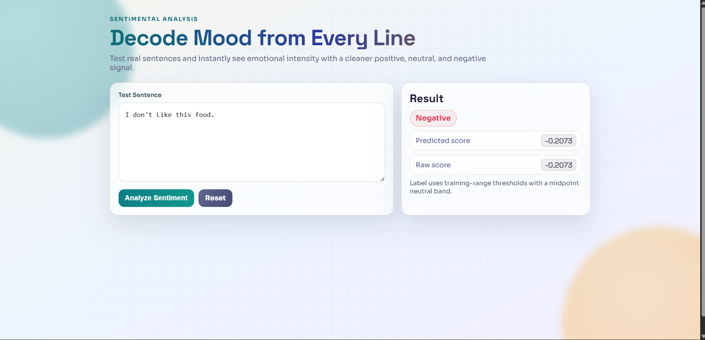

# Sentiment Analysis using NLP, TF-IDF & Random Forest Regression

---

# Decode Mood From Every Line

This project performs **sentiment analysis on social media text** using Natural Language Processing and Machine Learning.

Unlike traditional sentiment classifiers, this system predicts a **continuous sentiment score** using a **Random Forest Regression model**, which allows us to measure the **intensity of emotions in text** rather than simply classifying it as positive or negative.

A **Flask-based web interface** allows users to enter sentences and instantly view the predicted sentiment along with its numerical score.

---

# Application Interface

Below is the web interface where users can test sentences and view sentiment predictions.

The interface allows users to:

• Enter a sentence to analyze  
• Predict sentiment instantly  
• View sentiment label (Positive / Neutral / Negative)  
• See predicted sentiment score  
• Reset and test new inputs  

---

# Key Features

- Predicts **continuous sentiment scores**
- Converts scores into **Positive / Neutral / Negative labels**
- Custom **text normalization pipeline**
- Uses **TF-IDF feature extraction**
- **Dimensionality reduction using Truncated SVD**
- **Random Forest Regression model**
- Interactive **Flask Web UI**

---

# Machine Learning Pipeline

The sentiment prediction system follows a complete machine learning pipeline:

Raw Text Input

       ↓
Text Normalization

       ↓
TF-IDF Vectorization

       ↓
Dimensionality Reduction (SVD)

       ↓
Random Forest Regression

       ↓
Sentiment Score Prediction

       ↓
Label Mapping (Negative / Neutral / Positive)
